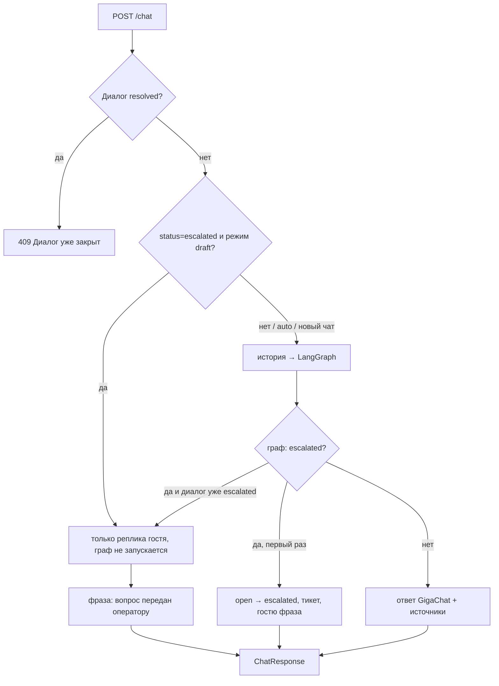
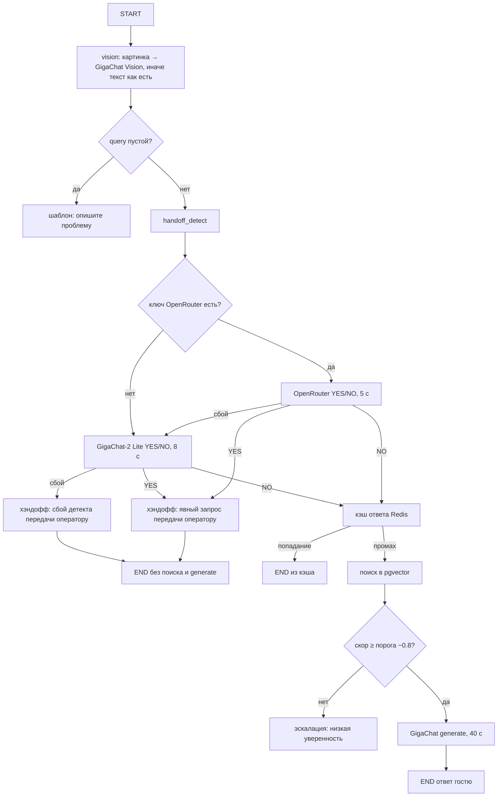

# Molvest AI-Agent

AI-агент техподдержки 1С для АО «Молвест»: ответы по базе знаний (RAG),
анализ скриншотов ошибок 1С, эскалация оператору. Ядро ответов — **GigaChat**.
«Позовите оператора» ловит отдельная нода (OpenRouter, иначе GigaChat-2).

[Как работает](#как-работает) · [Быстрый старт](#быстрый-старт) · [Документация](#документация)

## Что это

Четыре сценария ТЗ, один диалоговый граф. Разбор каждого —
[`docs/SCENARIOS.md`](docs/SCENARIOS.md).

| Сценарий | Поверхностно |
| --- | --- |
| 1. Вопрос текстом | Bitrix / Redmine / виджет → поиск в базе → ответ или человек |
| 2. Подсказка оператору | после эскалации в `draft` бот молчит гостю, черновик в `/operator` |
| 3. Скриншот 1С | картинка → Vision → тот же поиск и порог, что у текста |
| 4. База знаний | админка: загрузка документов, чанки, эмбеддинги |

Порог уверенности (~80%) и явная просьба «нужен человек» — два пути к
оператору. Гостю при эскалации: «Вопрос передан оператору техподдержки.»
В Bitrix гостю тишина, черновик — оператору.

## Как работает

Вход виджета и каналов — `POST /chat` (`run_chat_turn`). Ядро не знает,
Bitrix это или браузер.

### До и после графа



На виджете первая эскалация **без** черновика в `suggested_response`.
Bitrix и Redmine после commit считают черновик сами.

### Граф



Если гость зовёт человека или детект сломался — **не** отвечаем из базы.
RAG только после NO.

## Что внутри

| Часть | Стек | Как запускается |
| --- | --- | --- |
| API | FastAPI, Python 3.12, uv | Docker (`make up`) или локально (`make api`) |
| БД | PostgreSQL 16 + pgvector | Docker (`make up` или `make db`) |
| UI | Next.js, pnpm | Docker (`make up` / `make frontend`) |

`make up` поднимает Postgres, API и Next.js и применяет миграции Alembic
до того, как API начнёт отвечать. UI: http://localhost:3000.

## Быстрый старт

Нужны: [Docker Desktop](https://docs.docker.com/get-started/get-docker/),
[Git](https://git-scm.com/), [Make](https://www.gnu.org/software/make/)
(на macOS уже есть; на Windows — Git Bash или WSL).

```bash
git clone <repo-url>
cd Molvest-solution
make setup          # .env + API + Postgres + UI
```

| URL | Назначение |
| --- | --- |
| http://localhost:3000 | консоль и виджет |
| http://localhost:8000/health | живость API |
| http://localhost:8000/docs | Swagger, в том числе `POST /chat` |

> [!IMPORTANT]
> Без `.env` в корне `docker compose` падает. `make setup` копирует его из
> [`.env.example`](.env.example). Файл не коммитить.

`GIGACHAT_API_KEY` нужен для ответов по 1С. `/health` живёт и без ключа.
Ключ: [developers.sber.ru/gigachat](https://developers.sber.ru/gigachat).

Make, два способа гонять API, env и типичные поломки —
[`docs/DEV.md`](docs/DEV.md). Эксплуатация после старта —
[`docs/OPS.md`](docs/OPS.md). Проверки качества — GitHub Actions на PR и `main`.

## Каналы

Ядро одно. Специфика протокола — в адаптере канала.

| Канал | Куда смотреть |
| --- | --- |
| Виджет | этот README, `POST /chat` |
| Bitrix24 (онлайн-чат и коннектор) | [`docs/BITRIX.md`](docs/BITRIX.md) |
| Redmine HelpDesk | [`docs/REDMINE.md`](docs/REDMINE.md) |

## Документация

| Файл | Содержание |
| --- | --- |
| [docs/DEV.md](docs/DEV.md) | запуск, Make, `.env`, troubleshooting |
| [docs/OPS.md](docs/OPS.md) | эксплуатация: env, `/health`, БЗ, режимы |
| [docs/BITRIX.md](docs/BITRIX.md) | портал, ngrok, бот и коннектор |
| [docs/REDMINE.md](docs/REDMINE.md) | вебхук тикета, IMAP |
| [docs/SCENARIOS.md](docs/SCENARIOS.md) | 4 сценария ТЗ |
| [docs/TESTS.md](docs/TESTS.md) | что какой тест закрывает |
| [docs/ROADMAP.md](docs/ROADMAP.md) | этапы и критерии готовности |
| [AGENTS.md](AGENTS.md) | стек и инварианты для AI-агентов |
| [docs/technical spec/](docs/technical%20spec/) | исходное ТЗ хакатона |
