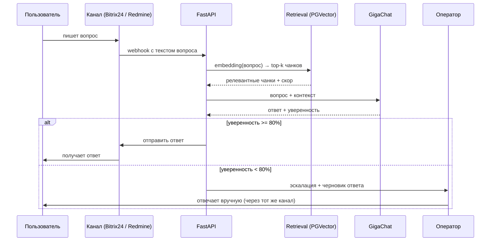
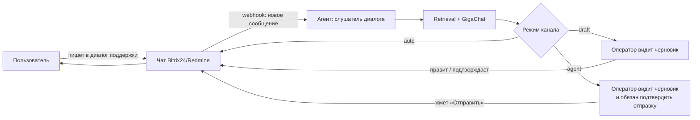
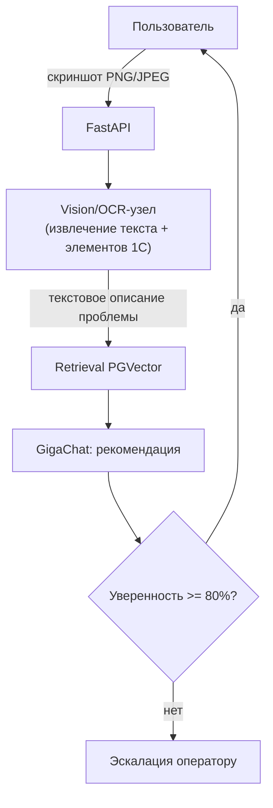
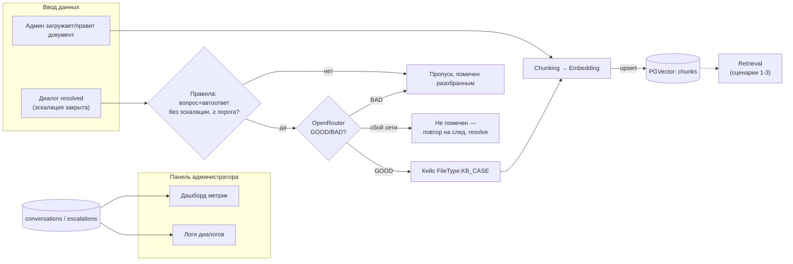
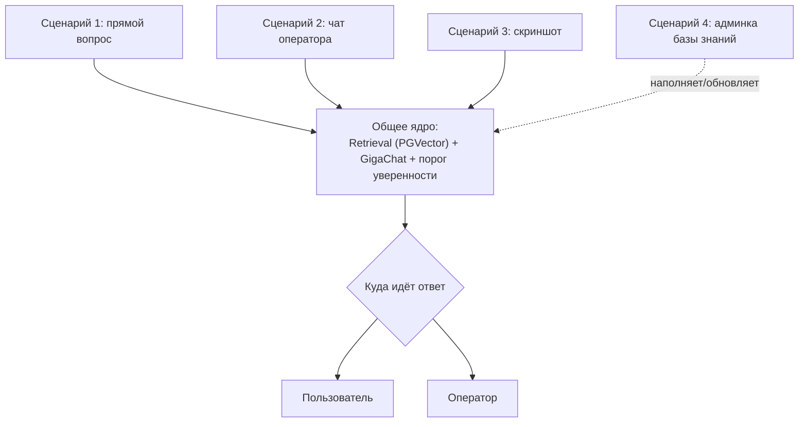

# Сценарии AI-агента — Молвест (техподдержка 1С)

Источник: ТЗ заказчика (АО «Молвест»). Ниже — детальный разбор всех 4 обязательных сценариев с диаграммами механизма работы каждого.

---

## Сценарий 1 — Q&A чат-бот

**Что это:** пользователь пишет вопрос текстом в Bitrix24 или на почту (Redmine HelpDesk), агент ищет ответ в базе знаний и либо отвечает сам, либо передаёт вопрос человеку.

**Ключевая механика — порог уверенности.** Это единственная точка ветвления в сценарии, и именно она определяет, работает ли автоматизация или превращается в "чат-бот, который всё эскалирует". Порог — это similarity-скор ретривала (совпадение топ-1 чанка с вопросом в pgvector), а не самооценка уверенности модели; GigaChat её не выставляет. Если скор ниже ~80%, ответ пользователю не уходит — вместо этого создаётся тикет оператору.

**Шаги:**
1. Сообщение приходит через Bitrix24 (чат) или Redmine (почта → тикет).
2. FastAPI-эндпоинт принимает запрос, кладёт его в LangGraph-граф диалога.
3. Узел retrieval ищет релевантные чанки в PGVector по эмбеддингу вопроса.
4. GigaChat получает вопрос + найденный контекст и генерирует ответ; уверенность — это similarity-скор retrieval'а (совпадение top-1 чанка), а не самооценка модели.
5. Ветвление по порогу:
   - **≥ 80%** → ответ уходит пользователю напрямую.
   - **< 80%** → диалог помечается `escalated`, создаётся запись в `escalations`, оператор получает уведомление вместе с черновиком ответа (чтобы не начинать с нуля).
6. Весь обмен логируется в `messages`/`conversations` для метрик (% автоответов, среднее время).

---

## Сценарий 2 — Автоматическое подключение к чату

**Что это:** в отличие от сценария 1 (пользователь инициирует запрос к боту), здесь агент **пассивно слушает** уже идущий диалог "пользователь ↔ оператор" и в реальном времени готовит подсказки/черновики, ускоряя работу оператора. Агент не является отдельным участником переписки для пользователя — он работает "за спиной" оператора (или отвечает напрямую, если так настроено).

**Ключевая механика — три режима вывода (`OPERATOR_ASSIST_MODE`).** Настройка
канала определяет, куда идёт сгенерированный ответ: оператору как черновик
(`draft`), сразу пользователю (`auto`), либо оператору как черновик, который
он обязан подтвердить нажатием «Отправить», прежде чем текст уйдёт гостю
(`agent`). Подробная таблица режимов — [OPS.md](OPS.md#порог-и-режимы).

**Шаги:**
1. Агент подписывается на события чата (webhook на новое сообщение в диалоге Bitrix24/Redmine).
2. При новом сообщении пользователя агент прогоняет его через тот же RAG-граф, что и в сценарии 1.
3. Результат генерации не блокируется порогом уверенности так же строго — вместо "отвечать/эскалировать" здесь всегда есть человек в цикле (если настроен `draft`/`agent`).
4. В зависимости от настройки канала:
   - **`draft`:** черновик подставляется в поле ввода оператора / отправляется ему отдельным сообщением; после первой эскалации граф на реплики гостя больше не гоняется.
   - **`auto`:** ответ уходит пользователю напрямую (аналогично сценарию 1, но без явного вопроса "к боту" — бот встроен в обычный диалог поддержки); после эскалации следующие реплики гостя снова могут уйти автоответом.
   - **`agent`:** сырой ответ ИИ гостю **никогда** не уходит. Готовый ответ графа (или follow-up гостя после того, как оператор уже написал в ленту) всегда оседает черновиком `suggested_response`; отправляет его только оператор из `/operator`. Повтор «Позовите оператора» в уже эскалированном диалоге черновик не трогает.

---

## Сценарий 3 — Анализ изображений (скриншотов 1С)

**Что это:** пользователь вместо текста присылает скриншот ошибки в 1С. Агент должен извлечь из картинки текст/визуальные признаки, понять проблему и дать рекомендацию — без участия того же текстового RAG-пайплайна на входе (вход другой модальности, но выход должен слиться с общим диалогом).

**Ключевая механика — картинка становится текстовым описанием проблемы, которое дальше идёт по тому же RAG-пути, что и обычный вопрос.** Это важно нарисовать: не два параллельных пайплайна, а один общий диалоговый граф с дополнительным узлом предобработки на входе.

**Шаги:**
1. Пользователь прикладывает PNG/JPEG к сообщению.
2. Узел vision/OCR извлекает: текст ошибки (код, сообщение), опознаёт элементы интерфейса 1С (некорректное поле, диалоговое окно).
3. Извлечённые данные форматируются в текстовое описание проблемы ("Ошибка: код 1С:8330, поле 'Договор' не заполнено, форма 'Расходная накладная'").
4. Это описание уходит в тот же RAG-узел, что и текстовый вопрос (сценарий 1) — ищется релевантная документация/кейсы по коду ошибки.
5. GigaChat формирует рекомендацию по устранению; дальше — тот же порог уверенности и та же логика эскалации, что в сценарии 1.

*Диаграмма намеренно показывает, что узел VIS впадает в тот же RAG-путь, что и текстовый вход в сценарии 1 — это один граф LangGraph с разными точками входа, а не отдельная система.*

---

## Сценарий 4 — Управление базой знаний

**Что это:** единственный сценарий без диалога с конечным пользователем — это админский контур, через который поддерживается актуальность данных, на которых работают сценарии 1–3. Без него RAG деградирует со временем (устаревшие ответы).

**Ключевая механика — переиндексация при изменении документа.** Просто "загрузка файла" — не история; важно показать, что любое изменение документа обязано пройти через (ре)чанкинг и пересчёт эмбеддингов, иначе поиск будет ссылаться на старую версию текста.

**Шаги:**
1. Администратор через React-панель загружает/редактирует/удаляет документ (инструкция, регламент, документация 1С, разобранный кейс из журнала обращений).
2. FastAPI сохраняет исходник, запускает пайплайн: чанкинг → эмбеддинг → запись/обновление в PGVector (старые чанки этого документа удаляются перед вставкой новых).
3. Отдельно: после `resolve` эскалированного диалога успешные кейсы попадают в базу автоматически ("обучение на кейсах", `app/services/case_learning.py`) — правила + малая LLM (OpenRouter GOOD/BAD) отбирают пару «вопрос — автоответ», тот же пайплайн чанкинга/эмбеддинга, но источник — `conversations`, а не ручная загрузка. Важная граница: в кейс попадает последний неэскалированный автоответ ассистента (прошедший тот же порог уверенности), а не финальное решение оператора — если ответ гостю писал оператор вручную, `extract_case` его не увидит и подходящей пары для этого диалога не найдёт.
4. Админ видит в панели: список документов, статус индексации, дашборд метрик (% автоответов, среднее время ответа, число эскалаций), логи диалогов.

---

## Как всё это связано между собой

Все три "живых" сценария (1, 2, 3) — это входы в **один** диалоговый граф LangGraph с общим узлом retrieval + GigaChat и общей логикой порога уверенности/эскалации. Разница только во входной модальности (прямой вопрос / подслушанный чат / скриншот) и в том, куда уходит выход (пользователю / оператору как черновик). Сценарий 4 — это контур обратной связи, который наполняет и обновляет базу, от качества которой зависит retrieval во всех трёх остальных.

